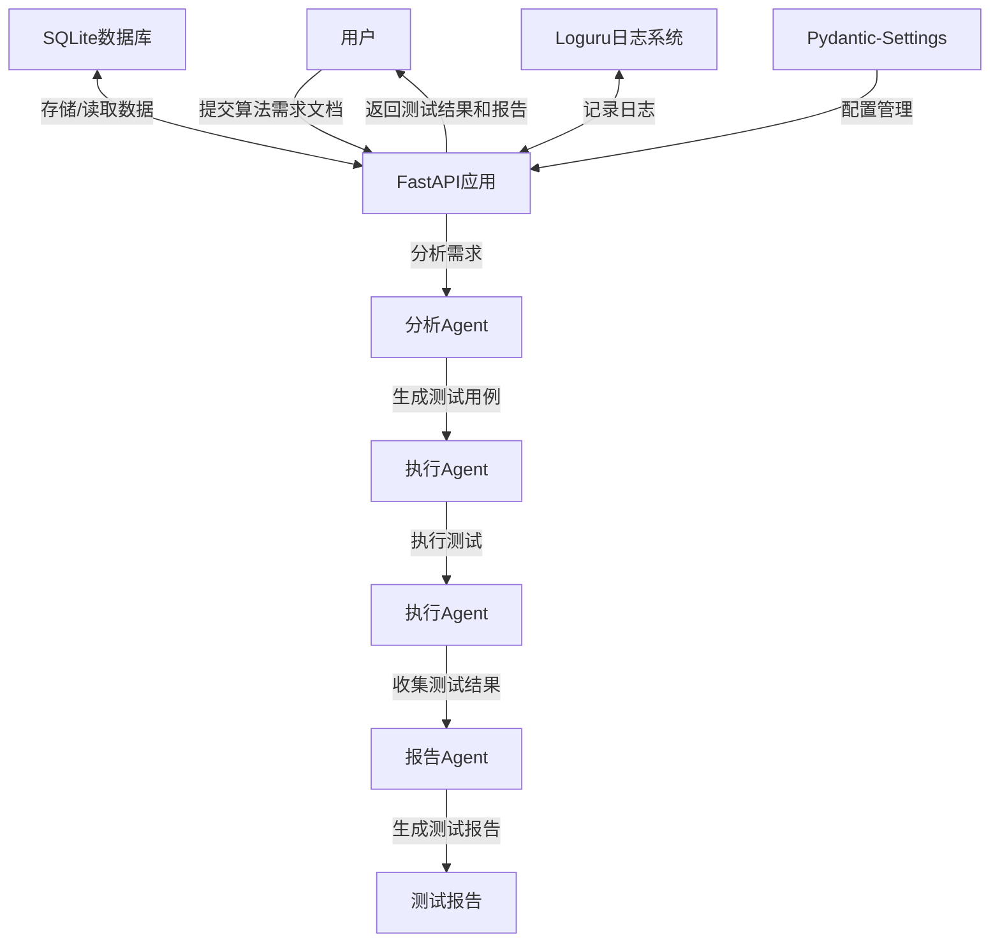

# 大模型驱动算法测试系统设计文档

## 1. 项目概述

本项目旨在使用langgraph构建一个大模型驱动的算法测试系统，该系统能够分析用户输入的算法需求文档，生成测试用例，执行测试，并生成测试报告。系统将通过FastAPI封装为API服务，提供RESTful接口供外部调用。系统采用loguru进行日志管理，使用SQLite进行数据存储，并通过pydantic-settings进行配置管理。

## 2. 系统架构

系统由三个核心Agent组成，每个Agent负责特定的功能：

1. **分析Agent**：负责分析用户输入的算法需求文档，通过大模型解析需求文档并产出可执行的算法测试命令，生成测试用例以验证各个参数下算法的效果及指定功能的可用性
2. **执行Agent**：负责执行测试用例，包括拉取需求中指定的算法镜像、获取测试数据集、执行测试命令，以及收集和验证测试结果
3. **报告Agent**：负责收集测试结果，根据模板整理成最终报告输出

这三个Agent通过langgraph框架组织为一个工作流，由FastAPI应用程序封装为API服务。所有操作都通过loguru进行日志记录，测试数据和结果存储在SQLite数据库中。

### 2.1 系统架构图



## 3. 核心组件设计

### 3.1 分析Agent

分析Agent负责解析用户提供的算法需求文档，通过大模型提取关键信息，并生成可执行的测试用例，以验证各个参数下算法的效果及指定功能的可用性。

#### 3.1.1 状态定义

```python
class AnalysisState(TypedDict):
    requirement_doc: str  # 用户提供的需求文档
    parsed_requirements: Dict[str, Any]  # 解析后的需求信息
    test_cases: List[Dict[str, Any]]  # 生成的测试用例
    errors: List[str]  # 错误信息
    log_context: Dict[str, Any]  # 日志上下文信息
```

#### 3.1.2 工作流节点

- **parse_requirements**：使用大模型解析需求文档，提取关键信息
- **generate_test_cases**：根据解析后的需求生成测试用例，包括算法测试命令
- **save_to_database**：将生成的测试用例保存到SQLite数据库

#### 3.1.3 工作流定义

```python
analysis_graph = StateGraph(AnalysisState)
analysis_graph.add_node("parse_requirements", parse_requirements)
analysis_graph.add_node("generate_test_cases", generate_test_cases)
analysis_graph.add_node("save_to_database", save_to_database)
analysis_graph.add_edge("parse_requirements", "generate_test_cases")
analysis_graph.add_edge("generate_test_cases", "save_to_database")
analysis_graph.set_entry_point("parse_requirements")
analysis_graph.set_finish_point("save_to_database")
```

### 3.2 执行Agent

执行Agent负责执行测试用例，包括拉取需求中指定的算法镜像、获取测试数据集、执行测试命令，以及收集和验证测试结果。

#### 3.2.1 状态定义

```python
class ExecutionState(TypedDict):
    test_cases: List[Dict[str, Any]]  # 测试用例
    algorithm_image: str  # 算法Docker镜像
    dataset_path: str  # 数据集路径
    execution_results: List[Dict[str, Any]]  # 执行结果
    errors: List[str]  # 错误信息
    log_context: Dict[str, Any]  # 日志上下文信息
```

#### 3.2.2 工作流节点

- **pull_algorithm_image**：拉取需求中指定的算法Docker镜像
- **fetch_dataset**：获取需求中用于测试验证的数据集
- **execute_test_cases**：执行测试用例并收集结果
- **validate_results**：验证测试结果是否符合预期
- **save_results_to_database**：将测试结果保存到SQLite数据库

#### 3.2.3 工作流定义

```python
execution_graph = StateGraph(ExecutionState)
execution_graph.add_node("pull_algorithm_image", pull_algorithm_image)
execution_graph.add_node("fetch_dataset", fetch_dataset)
execution_graph.add_node("execute_test_cases", execute_test_cases)
execution_graph.add_node("validate_results", validate_results)
execution_graph.add_node("save_results_to_database", save_results_to_database)
execution_graph.add_edge("pull_algorithm_image", "fetch_dataset")
execution_graph.add_edge("fetch_dataset", "execute_test_cases")
execution_graph.add_edge("execute_test_cases", "validate_results")
execution_graph.add_edge("validate_results", "save_results_to_database")
execution_graph.set_entry_point("pull_algorithm_image")
execution_graph.set_finish_point("save_results_to_database")
```

### 3.3 报告Agent

报告Agent负责收集测试结果，根据模板整理成最终报告输出。

#### 3.3.1 状态定义

```python
class ReportState(TypedDict):
    execution_results: List[Dict[str, Any]]  # 执行结果
    report_template: str  # 报告模板
    final_report: str  # 最终报告
    report_format: str  # 报告格式（html, markdown, pdf）
    errors: List[str]  # 错误信息
    log_context: Dict[str, Any]  # 日志上下文信息
```

#### 3.3.2 工作流节点

- **fetch_results_from_database**：从SQLite数据库获取测试结果
- **collect_test_results**：整理测试结果数据
- **generate_report**：根据模板生成测试报告
- **save_report**：保存最终报告到文件和数据库

#### 3.3.3 工作流定义

```python
report_graph = StateGraph(ReportState)
report_graph.add_node("fetch_results_from_database", fetch_results_from_database)
report_graph.add_node("collect_test_results", collect_test_results)
report_graph.add_node("generate_report", generate_report)
report_graph.add_node("save_report", save_report)
report_graph.add_edge("fetch_results_from_database", "collect_test_results")
report_graph.add_edge("collect_test_results", "generate_report")
report_graph.add_edge("generate_report", "save_report")
report_graph.set_entry_point("fetch_results_from_database")
report_graph.set_finish_point("save_report")
```

### 3.4 日志系统

系统使用loguru进行日志管理，记录系统运行过程中的各种事件和错误信息。

#### 3.4.1 日志配置

```python
from loguru import logger

# 配置日志输出
logger.add(
    "logs/algorithm_test_{time}.log",
    rotation="500 MB",
    retention="10 days",
    level="INFO",
    format="{time:YYYY-MM-DD HH:mm:ss} | {level} | {name}:{function}:{line} - {message}",
    backtrace=True,
    diagnose=True
)
```

#### 3.4.2 日志使用示例

```python
# 在Agent中使用日志
def parse_requirements(state: AnalysisState) -> AnalysisState:
    logger.info(f"开始解析需求文档: {state['requirement_doc'][:100]}...")
    try:
        # 解析逻辑
        parsed_requirements = {}
        # ...
        logger.success("需求文档解析成功")
        return {**state, "parsed_requirements": parsed_requirements}
    except Exception as e:
        logger.error(f"需求文档解析失败: {str(e)}")
        return {**state, "errors": state.get("errors", []) + [str(e)]}
```

### 3.5 数据存储

系统使用SQLite进行数据存储，包括测试用例、测试结果和测试报告等信息。主要数据表包括：

- **test_tasks**：存储测试任务信息
- **test_cases**：存储测试用例信息
- **test_results**：存储测试结果信息
- **test_reports**：存储测试报告信息

### 3.6 配置管理

系统使用pydantic-settings进行配置管理，包括API服务配置、数据库配置、日志配置等。

#### 3.6.1 配置定义

```python
from pydantic_settings import BaseSettings, SettingsConfigDict
from typing import Optional, Dict, Any, List

class Settings(BaseSettings):
    # API服务配置
    api_host: str = "0.0.0.0"
    api_port: int = 8000
    api_workers: int = 4
    api_timeout: int = 60
    
    # 数据库配置
    db_url: str = "sqlite:///algorithm_test.db"
    
    # 日志配置
    log_level: str = "INFO"
    log_file: str = "logs/algorithm_test_{time}.log"
    log_rotation: str = "500 MB"
    log_retention: str = "10 days"
    
    # Docker配置
    docker_registry: Optional[str] = None
    docker_username: Optional[str] = None
    docker_password: Optional[str] = None
    
    # 大模型配置
    llm_api_key: str
    llm_model: str = "gpt-4"
    llm_temperature: float = 0.7
    
    # 报告配置
    report_template_path: str = "templates/report_template.md"
    
    model_config = SettingsConfigDict(
        env_file=".env",
        env_file_encoding="utf-8",
        extra="ignore"
    )

# 加载配置
settings = Settings()
```

#### 3.6.2 配置使用示例

```python
# 在FastAPI应用中使用配置
from fastapi import FastAPI
import uvicorn

app = FastAPI(title="算法测试系统", version="1.0.0")

# ...

if __name__ == "__main__":
    uvicorn.run(
        "api.app:app",
        host=settings.api_host,
        port=settings.api_port,
        workers=settings.api_workers,
        timeout_keep_alive=settings.api_timeout
    )
```

### 3.7 FastAPI应用程序

FastAPI应用程序封装了上述三个Agent的功能，提供RESTful API接口供外部调用。

#### 3.7.1 API接口

- **POST /api/tests**：提交新的算法测试请求
- **GET /api/tests/{task_id}**：获取测试任务状态
- **GET /api/tests/{task_id}/report**：获取测试报告
- **GET /api/tests**：获取所有测试任务列表

#### 3.7.2 数据模型

```python
from pydantic import BaseModel
from typing import Optional, List, Dict, Any
from datetime import datetime

class TestRequest(BaseModel):
    requirement_doc: str  # 需求文档
    algorithm_image: str  # 算法镜像
    dataset_url: Optional[str] = None  # 数据集URL
    report_format: str = "html"  # 报告格式

class TestCase(BaseModel):
    id: str
    command: str
    parameters: Dict[str, Any]

class TestResult(BaseModel):
    case_id: str
    status: str
    output: str
    metrics: Dict[str, Any]

class TestResponse(BaseModel):
    task_id: str  # 任务ID
    status: str  # 任务状态
    created_at: datetime
    updated_at: datetime
    test_cases: Optional[List[TestCase]] = None
    results: Optional[List[TestResult]] = None
    report_url: Optional[str] = None
```

## 4. 项目结构

```
ALGOTEST/
├── README.md
├── requirements.txt
├── setup.py
├── .env.example
├── .gitignore
├── main.py
├── algorithm_test.db  # SQLite数据库文件
├── agents/
│   ├── __init__.py
│   ├── analysis_agent.py
│   ├── execution_agent.py
│   └── report_agent.py
├── api/
│   ├── __init__.py
│   ├── app.py
│   ├── models.py
│   └── routes.py
├── core/
│   ├── __init__.py
│   ├── config.py  # 配置管理
│   ├── database.py  # 数据库模型和操作
│   ├── logger.py  # 日志配置
│   └── utils.py
├── logs/  # 日志文件目录
├── templates/
│   └── report_template.md
└── tests/
    ├── __init__.py
    ├── test_analysis_agent.py
    ├── test_execution_agent.py
    └── test_report_agent.py
```

## 5. 依赖管理

项目依赖包括：

```
fastapi>=0.95.0
uvicorn>=0.22.0
pydantic>=2.0.0
pydantic-settings>=2.0.0
langchain>=0.0.267
langgraph>=0.0.10
docker>=6.1.0
jinja2>=3.1.2
markdown>=3.4.3
python-dotenv>=1.0.0
python-multipart>=0.0.6
requests>=2.31.0
sqlalchemy>=2.0.0
loguru>=0.7.0
```

## 6. 实现计划

### 6.1 实现分析Agent（复杂度：8）

开发负责分析用户输入的算法需求文档的Agent，使用大模型解析需求文档并产出可执行的算法测试命令，生成测试用例以验证各个参数下算法的效果及指定功能的可用性。

### 6.2 实现执行Agent（复杂度：7）

开发负责执行测试用例的Agent，包括拉取需求中指定的算法镜像、获取测试数据集、执行测试命令，以及收集和验证测试结果。

### 6.3 实现报告Agent（复杂度：6）

开发负责收集测试结果并根据模板整理成最终报告输出。报告应包含测试概述、测试用例详情、测试结果分析和总结。

### 6.4 实现数据库和日志系统（复杂度：5）

设计并实现SQLite数据库模型，实现数据的存储和检索功能。配置loguru日志系统，记录系统运行过程中的各种事件和错误信息。

### 6.5 实现配置管理（复杂度：4）

使用pydantic-settings实现配置管理，包括API服务配置、数据库配置、日志配置等。

### 6.6 实现FastAPI API封装（复杂度：5）

开发FastAPI应用程序，封装算法测试系统的功能，提供RESTful API接口，包括提交算法需求文档、查询测试进度、获取测试报告等功能。

### 6.7 设置项目结构和依赖管理（复杂度：3）

创建项目目录结构，设置虚拟环境，管理项目依赖，包括langgraph、FastAPI、Docker、Jinja2、SQLAlchemy、loguru等库。

## 7. 总结

本项目使用langgraph构建大模型驱动的算法测试系统，通过三个核心Agent（分析Agent、执行Agent和报告Agent）实现算法需求文档的解析、测试用例的执行和测试报告的生成。系统通过FastAPI封装为API服务，提供RESTful接口供外部调用。系统采用loguru进行日志管理，使用SQLite进行数据存储，并通过pydantic-settings进行配置管理。该系统将大大提高算法测试的效率和准确性，为算法开发提供有力支持。
