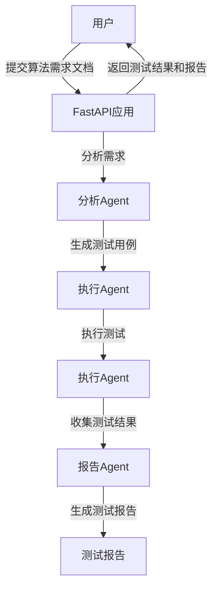

# 大模型驱动算法测试系统设计文档

## 1. 项目概述

本项目旨在使用langgraph构建一个大模型驱动的算法测试系统，该系统能够分析用户输入的算法需求文档，生成测试用例，执行测试，并生成测试报告。系统将通过FastAPI封装为API服务，提供RESTful接口供外部调用。

## 2. 系统架构

系统由三个核心Agent组成，每个Agent负责特定的功能：

1. **分析Agent**：负责分析用户输入的算法需求文档，解析需求并生成测试用例
2. **执行Agent**：负责执行测试用例，包括拉取算法镜像、获取数据集、执行测试命令，以及收集测试结果
3. **报告Agent**：负责收集测试结果，根据模板生成最终测试报告

这三个Agent通过langgraph框架组织为一个工作流，由FastAPI应用程序封装为API服务。

### 2.1 系统架构图


```mermaid
graph TD
    A[用户] -->|提交算法需求文档| B[FastAPI应用]
    B -->|分析需求| C[分析Agent]
    C -->|生成测试用例| D[执行Agent]
    D -->|执行测试| E[执行Agent]
    E -->|收集测试结果| F[报告Agent]
    F -->|生成测试报告| G[测试报告]
    B -->|返回测试结果和报告| A
```

## 3. 核心组件设计

### 3.1 分析Agent

分析Agent负责解析用户提供的算法需求文档，提取关键信息，并生成可执行的测试用例。

#### 3.1.1 状态定义

```python
class AnalysisState(TypedDict):
    requirement_doc: str  # 用户提供的需求文档
    parsed_requirements: Dict[str, Any]  # 解析后的需求信息
    test_cases: List[Dict[str, Any]]  # 生成的测试用例
    errors: List[str]  # 错误信息
```

#### 3.1.2 工作流节点

- **parse_requirements**：使用大模型解析需求文档，提取关键信息
- **generate_test_cases**：根据解析后的需求生成测试用例

#### 3.1.3 工作流定义

```python
analysis_graph = StateGraph(AnalysisState)
analysis_graph.add_node("parse_requirements", parse_requirements)
analysis_graph.add_node("generate_test_cases", generate_test_cases)
analysis_graph.add_edge("parse_requirements", "generate_test_cases")
analysis_graph.set_entry_point("parse_requirements")
analysis_graph.set_finish_point("generate_test_cases")
```

### 3.2 执行Agent

执行Agent负责执行测试用例，包括拉取算法镜像、获取数据集、执行测试命令，以及收集测试结果。

#### 3.2.1 状态定义

```python
class ExecutionState(TypedDict):
    test_cases: List[Dict[str, Any]]  # 测试用例
    algorithm_image: str  # 算法Docker镜像
    dataset_path: str  # 数据集路径
    execution_results: List[Dict[str, Any]]  # 执行结果
    errors: List[str]  # 错误信息
```

#### 3.2.2 工作流节点

- **pull_algorithm_image**：拉取算法Docker镜像
- **fetch_dataset**：获取测试数据集
- **execute_test_cases**：执行测试用例并收集结果

#### 3.2.3 工作流定义

```python
execution_graph = StateGraph(ExecutionState)
execution_graph.add_node("pull_algorithm_image", pull_algorithm_image)
execution_graph.add_node("fetch_dataset", fetch_dataset)
execution_graph.add_node("execute_test_cases", execute_test_cases)
execution_graph.add_edge("pull_algorithm_image", "fetch_dataset")
execution_graph.add_edge("fetch_dataset", "execute_test_cases")
execution_graph.set_entry_point("pull_algorithm_image")
execution_graph.set_finish_point("execute_test_cases")
```

### 3.3 报告Agent

报告Agent负责收集测试结果，根据模板生成最终测试报告。

#### 3.3.1 状态定义

```python
class ReportState(TypedDict):
    execution_results: List[Dict[str, Any]]  # 执行结果
    report_template: str  # 报告模板
    final_report: str  # 最终报告
    report_format: str  # 报告格式（html, markdown, pdf）
    errors: List[str]  # 错误信息
```

#### 3.3.2 工作流节点

- **collect_test_results**：整理测试结果数据
- **generate_report**：根据模板生成测试报告
- **save_report**：保存最终报告到文件

#### 3.3.3 工作流定义

```python
report_graph = StateGraph(ReportState)
report_graph.add_node("collect_test_results", collect_test_results)
report_graph.add_node("generate_report", generate_report)
report_graph.add_node("save_report", save_report)
report_graph.add_edge("collect_test_results", "generate_report")
report_graph.add_edge("generate_report", "save_report")
report_graph.set_entry_point("collect_test_results")
report_graph.set_finish_point("save_report")
```

### 3.4 FastAPI应用程序

FastAPI应用程序封装了上述三个Agent的功能，提供RESTful API接口供外部调用。

#### 3.4.1 API接口

- **POST /api/tests**：提交新的算法测试请求
- **GET /api/tests/{task_id}**：获取测试任务状态
- **GET /api/tests/{task_id}/report**：获取测试报告

#### 3.4.2 数据模型

```python
class TestRequest(BaseModel):
    requirement_doc: str  # 需求文档
    algorithm_image: str  # 算法镜像
    dataset_url: Optional[str] = None  # 数据集URL
    report_format: str = "html"  # 报告格式

class TestResponse(BaseModel):
    task_id: str  # 任务ID
    status: str  # 任务状态
```

## 4. 项目结构

```
algorithm_test_system/
├── README.md
├── requirements.txt
├── setup.py
├── .env.example
├── .gitignore
├── main.py
├── agents/
│   ├── __init__.py
│   ├── analysis_agent.py
│   ├── execution_agent.py
│   └── report_agent.py
├── api/
│   ├── __init__.py
│   ├── app.py
│   ├── models.py
│   └── routes.py
├── core/
│   ├── __init__.py
│   ├── config.py
│   └── utils.py
├── templates/
│   └── report_template.md
└── tests/
    ├── __init__.py
    ├── test_analysis_agent.py
    ├── test_execution_agent.py
    └── test_report_agent.py
```

## 5. 依赖管理

项目依赖包括：

```
fastapi>=0.95.0
uvicorn>=0.22.0
pydantic>=2.0.0
langchain>=0.0.267
langgraph>=0.0.10
docker>=6.1.0
jinja2>=3.1.2
markdown>=3.4.3
python-dotenv>=1.0.0
python-multipart>=0.0.6
requests>=2.31.0
```

## 6. 实现计划

### 6.1 实现分析Agent（复杂度：8）

开发负责分析用户输入的算法需求文档的Agent，使用大模型解析需求文档并产出可执行的算法测试命令，生成测试用例以验证各个参数下算法的效果及指定功能的可用性。

### 6.2 实现执行Agent（复杂度：7）

开发负责执行测试用例的Agent，包括拉取需求中指定的算法镜像、获取测试数据集、执行测试命令，以及收集和验证测试结果。

### 6.3 实现报告Agent（复杂度：6）

开发负责收集测试结果并根据模板生成最终测试报告的Agent。报告应包含测试概述、测试用例详情、测试结果分析和总结。

### 6.4 实现FastAPI API封装（复杂度：5）

开发FastAPI应用程序，封装算法测试系统的功能，提供RESTful API接口，包括提交算法需求文档、查询测试进度、获取测试报告等功能。

### 6.5 设置项目结构和依赖管理（复杂度：3）

创建项目目录结构，设置虚拟环境，管理项目依赖，包括langgraph、FastAPI、Docker、Jinja2等库。

## 7. 总结

本项目使用langgraph构建大模型驱动的算法测试系统，通过三个核心Agent（分析Agent、执行Agent和报告Agent）实现算法需求文档的解析、测试用例的执行和测试报告的生成。系统通过FastAPI封装为API服务，提供RESTful接口供外部调用。该系统将大大提高算法测试的效率和准确性，为算法开发提供有力支持。
